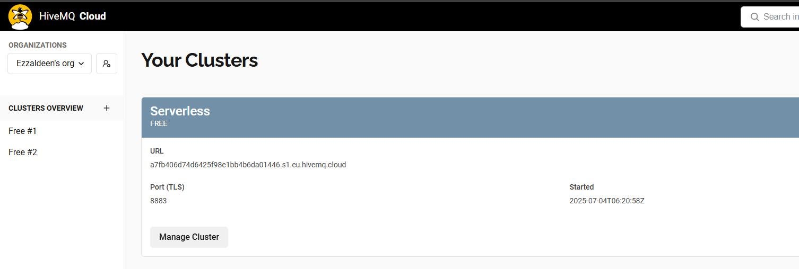
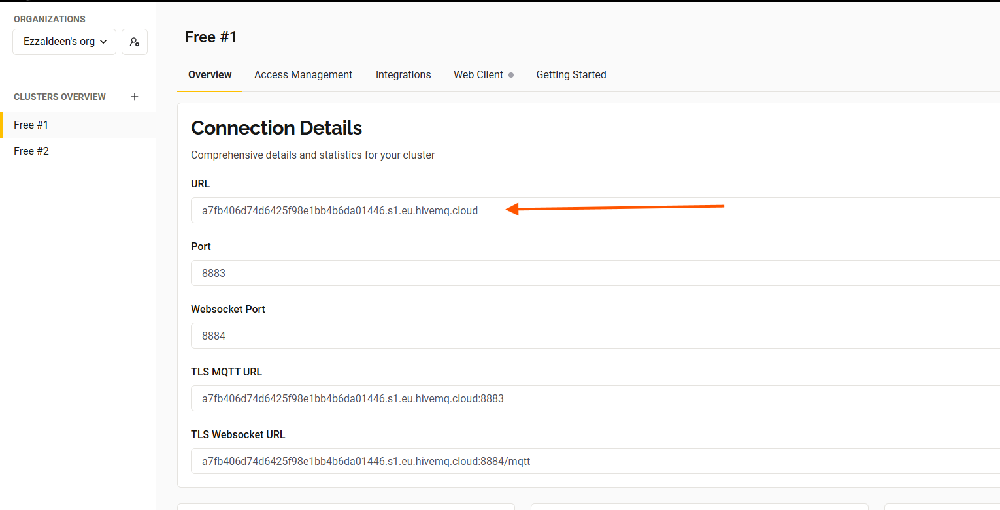
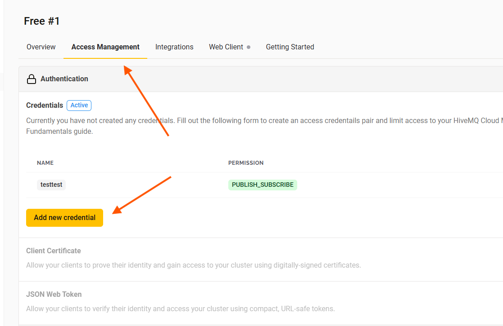
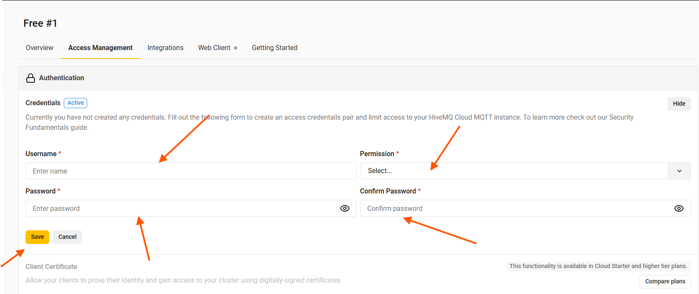
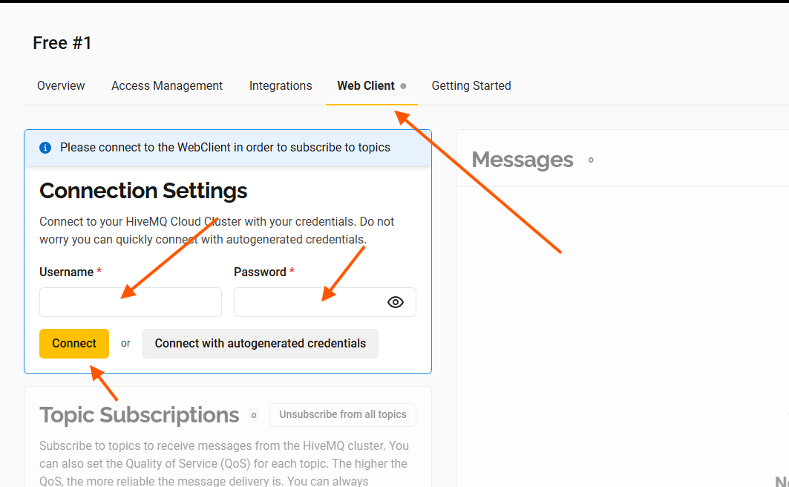
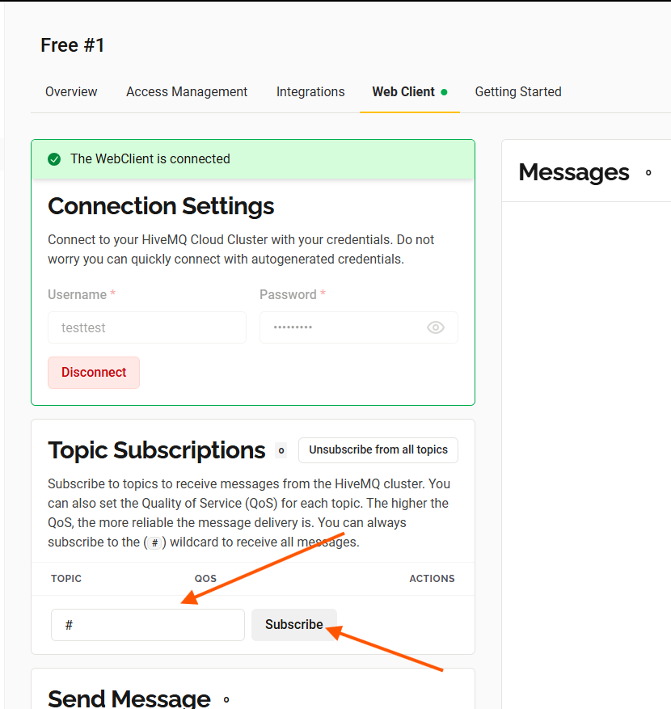
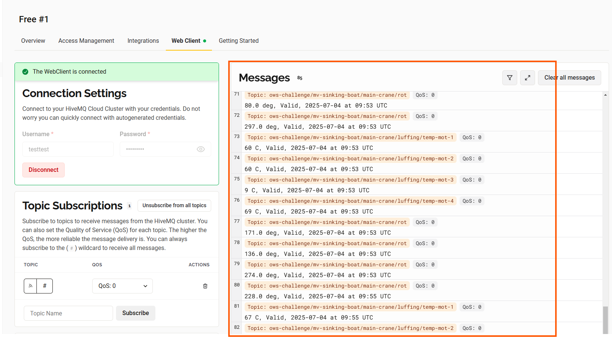

# MacGregor Maritime IoT Gateway

This project is a technical solution based on MacGregor technical challenge

## Challenge Overview
The IoT gateway is a simulated maritime Gateway that does the following:
- Reads temerature data from 4 luffing wich motors via **Modbus TCP**
- Reads Rate of Turn (ROT) data via Websocket that follows **NMEA protocol** format
- Connects and publish all data to a MQTT broker.


## Technical Details
### Design and Architecture
This Project is designed with modularity, and scalability and readability in mind:
- **Modularity**:
Each major function is encapsulated within its own module. This allows independent development, testing, easier trouble shooting and future enhancements without affecting other parts

- **Async Design**
Using `asyncio` enables parallel execution of tasks, optimizing performance and avoiding blocking.
- **Configuration Driven**
Centralized Configuration (`configs/config.py`) that allows easy environment changes and credentials management without modifying  the code. This enables smooth deployment to different environments.
- **Scalability**
The designed architecture supports easy extension by adding more sensors or protocols and adding their new modules and integrating them in main async loop.
- **Readability**
Having clear modules separation and well named functions to improve code readability was a Key requirements that ws essential to keep in mind.
### Project Structure
- **Modbus TCP Client** (`iot_gateway/modbus_client.py`)
Reads temperature data from holding registers of a simulated Modbus server.
- **Websocket ROT**  (`iot_gateway/nmea_client.py`)
Reads and parses NMEA-formatted messages from ROT sensor
- **Mqtt Publisher** (`iot_gateway/mqtt_publisher.py`) MQTT publisher to HiveMQ broker. Handles reconnects, Last Will & Testament
- **Configuration driven design** (`configs/config.py`)
Easy Environment changes via centralized config.
- **Logger** (`utils/logger.py`)
Implements centralized logging for the entire application.
It ensures that the logging across all modules follow the pre-defined format that helps in debugging and monitoring.
It supports different log levels.
- **Main Entry point**  (`Main.py`)
Uses `asyncio` to run all the components in parallel.

### Data Publishing Criteria
According to the task requirements, data should be published based on the following criteria:


| Criteria    | Details |
| -------- | ------- |
| **Data Change Threshold**	  | No update if the change is More than 1deg/min or 1C from previous value     |
| **Update Frequency** | Send update at least every 5 minutes even if data hasnt changed.     |
| **Keep Alive** | Connection to the Broker must be kept alive for Maximum 10 mins even if no data is sent and then shutdown   |
### Further developments
This project represents an inital implementation of the task requirments. However Im fully aware that there are several enhancements and features that could significantly improve the project. In real-world applications, many of these additions would be **essential**.

Below are  porential areas for future development:
- **Dockerize Each Module**
Containerize each component using Docker. This ensures Moduler deployements, simplifies scaling, and provides isolation within a single network
- **Intermediate Database for Offline Mode** In case of a broker disconnection, data can be buffered to a local lightweight database(eg. SQLite).
Once reconnected, the client can send the data to the broker in order.
-**Retry Mechanisms**
Many current connection attempts (MQTT, Modbus, NMEA) raise errors rather than retrying. Adding structured retry logic with backoff can greatly improve reliability.
- **Dashboard intergratoon**
A simple dashboard (eg.Grafana) can be connected to the broker to visualize the data send 
- **Enhanced security** 
Intoruces **TSL/SSL** encryotion to the communciton between different components.

- **Unit Testing**
The current project is lacks unit tests, Having them improves quiality and maintainability during changes.
- **CI/CD Pipeline**
Automatics testing that is triggered automatically in GitHub or Gitlab.


# Setup and run
### 1. Clone the repo 
```
git clone https://github.com/Ezzaldeen97/MacGregor_Technical_challenge.git
cd MacGregor_Technical_challenge
```

### 2. Create Virtual environment and install dependencies
```
python -m venv venv
venv\Scripts\activate
pip install -r requirements.txt
```

### 3. Clone and Run the Crane simulator

```
git clone https://github.com/ChiquiTi2/CraneIoT.git
cd CraneIoT
python crane_simulation.py
```
Keep the simulator running in the background while you start the gateway.


### 4. Preapare the HiveMQ cloud to read the data.
#### 4.1 Create an account
Visit [HiveQM Dashboard](https://www.mqtt-dashboard.com/) and sign up
#### 4.2 Setup a cluster (choose the free version)
once done you should see the cluster dashboard: 



### 4.3 Copy Cluster URL 


### 4.4 Create Credentials 
Generate Username and password and add them to ```configs/config.py```





Make sure to Replace the place holders in the config file with the username and password.
### 4.5 Setup the web client in the Server


Enter the username and password created in the previous step

### 4.6 Subscripe to a topic (or use # wildcard)



### 5. Start the IoT gateway.
```
cd ..
python Main.py
```


### 6. Check Transmitted data.

The data should appear in the mqtt broker dashboard



